<p align="center">

<br>
Global Server Load Balancing (GSLB) PCF
<br>
 **THIS IS A DRAFT !!!**
</p>

# Overview

This document describes 4 solutions on how to deploy multiple instances (or foundations) of PCF and load balance between them with various public and private on premesis GSLB methods.  This Delivery Kit is broken into the following sections

* Solution Logical Architecture
* Planning & Pre-Requisites
* Solution Deployment

This document will focus on the client facing or "North/South" traffic management points for an application to be published in multiple foundations.  It is beyond the scope of this Delivery Kit to cover topics such as distributed Application or Data architecture.  This topics will be covered in another Customer0 Delivery Kit.

It is assumed that readers of this document are familiar with administration of the following Platforms/Technologies:

* Pivotal Cloud Foundry 1.6/1.7
* DNS
* GSLB Platform: AWS, Azure, Dyn, F5

# Solution Logical Architecture
The main goal of a GSLB & PCF architecture is to provide optimized traffic distribution across PCF foundations deployed in multiple DataCenters or Geographies.  

<p align="center">

<br>
</p>

A common approach to achieving GSLB is via intelligent DNS resolution and is the core approach that will be covered in each example deployment.

**Warning**: Applications designed for peer communication or requiring access to geographically replicated data services will incur design and operational difficulty when PCF Foundations are separated by highly latent & geographically dispersed networks.

# Planning & Pre-Requisites
Planning for PCF to host an application across foundations requires some basic planning and setup...

**1**: Application routed namespace/domain(s)

In the examples covered in this delivery kit,  all applications will be mapped to a _*.customer0.net_ route.   This route will exist as part of a "shared-domain" in both of our example PCF foundations.

example: _customer0.net_

**2**: PCF System & App domains

Each foundation will still require its own resolvable url space for system access (_api, apps, login, uaa, etc_...) as well as local routed domains that are specific to each foundation for local only route mapps (_*.site-a.pcflab.net_).  This is so that traffic may be routed direct to a foundation regardless of the GSLB state, as well as for admin/pipeline access to actually push apps via the Cloud Foundry api.  These are the same domains that PCF Operations Manager describes as _System_ & _Apps_ Domains.

example:

| Site          | Function             | Domain                     |
| ------------- |:--------------------:| --------------------------:|
| site a        | system		         | _sys.site-a.pcflab.net_    |
| site a        | apps (shared domain) | _cfapps.site-a.pcflab.net_ |
| site b        | system		         | _sys.site-b.pcflab.net_    |
| site b        | apps (shared domain) | _cfapps.site-b.pcflab.net_ |

**3**: DNS

The DNS delegation for the chosen Application Domains must 

**4**: SSL

SANs

   

=======
## Solution Requirements
### PCF
### SSL
In order to provide a secure application endpoint a TLS/SSL certificate will need to be obtained and also a determination on where to terminate the SSL/TLS connection. Generally SSL termination will be done on the load balancing device (i.e. F5, Brocade) or cloud load balancers. This guide will cover that use case. However the implementation will vary depending on the security requirements. For more details:

* [Configuring Pivotal Cloud Foundry® SSL Termination for vSphere Deployments](http://docs.pivotal.io/pivotalcf/opsguide/ssl-term.html)
* [Providing a Certificate for your SSL Termination Point](https://docs.pivotal.io/pivotalcf/opsguide/security_config.html) 

For load balancers on a IAAS provider refer to the documentation below:

* [AWS - What Is Elastic Load Balancing?](http://docs.aws.amazon.com/ElasticLoadBalancing/latest/DeveloperGuide/elastic-load-balancing.html)
* [Azure - Application Gateway overview](https://azure.microsoft.com/en-us/documentation/articles/application-gateway-introduction/)


#### Obtaining a SSL/TLS Certificate
One of the first things you'll need is a SSL/TLS certificate. Generally the steps are: 

1. Create a Certificate Request
2. Have the certificate signed by a Certificate Authority or CA (i.e. Symantec, GoDaddy, DigiCert, etc)
3. Install the certifcate either on the load balancer or the web servers

##### Generating a Self-Signed Certificate
Many times you just need to test a setup or perform a POC. Generating certificate requests and having a CA sign them for testing generally can be costly and a un-necessary expense. Fortunately you can create a self-signed certificate for testing purposes.

There are two ways to create the certificate. First you can use the generate self-signed certificate through OpsManager. Secondly you can do this by using OpenSSL. 

###### Using OpsManager
One of the easiest ways to accomplish this is to use OpsManager to generate the self-signed certificate for you. Refer to the link [here](http://docs.pivotal.io/pivotalcf/opsguide/security_config.html). Once you have generated a self-signed certificate you can copy and paste the certificate and private key into a local file and deliver the certificate to the load-balancing device or IAAS cloud load balancer. The generated certificate will be in a PEM format.

For IAAS provider refer to the following documentation for AWS and Azure respectively:

* [AWS - SSL Certificates for Elastic Load Balancing](http://docs.aws.amazon.com/ElasticLoadBalancing/latest/DeveloperGuide/ssl-server-cert.html)
* [Azure - Configure an application gateway for SSL offload by using the classic deployment model](https://azure.microsoft.com/en-us/documentation/articles/application-gateway-ssl/)

For physical load balancers refer to the vendor documentation.

###### Using OpenSSL
Online information can be found here:

* <http://apetec.com/support/GenerateSAN-CSR.htm>
* <http://wiki.cacert.org/FAQ/subjectAltName>
* <http://www.openssl.org/docs/manmaster/apps/x509v3_config.html>

The steps are:

1. Create a openssl configuration file
2. Add the locality information
3. Add the Subject Alternate Name
4. Create a Certificate Request
5. Sign the certificate
6. Upload the certificate to the cloud provider or load balancer device

* Create a openssl.cnf file. Here is an example:

```
[ req ]
default_bits       = 4096
default_md         = sha512
default_keyfile    = my-private-key.pem
prompt             = no
encrypt_key        = no

# base request
distinguished_name = req_distinguished_name

# extensions
req_extensions     = v3_req

# distinguished_name
[ req_distinguished_name ]
countryName            = "US"                     # C=
stateOrProvinceName    = "NY"                     # ST=
localityName           = "NYC"                    # L=
postalCode             = "10011"                  # L/postalcode=
streetAddress          = "625 Avenue of Americas" # L/street=
organizationName       = "Pivotal Software"       # O=
organizationalUnitName = "Platform Architect"     # OU=
commonName             = "*.jyipivotal.io"        # CN=
emailAddress           = "jyi@pivotal.io"         # CN/emailAddress=

# req_extensions
[ v3_req ]
# The subject alternative name extension allows various literal values to be 
# included in the configuration file
# http://www.openssl.org/docs/apps/x509v3_config.html
subjectAltName  = 	DNS:*.login.cfsys.jyipivotal.io,DNS:*.uaa.cfsys.jyipivotal.io,DNS:*.api.cfsys.jyipivotal.io,DNS:*.apps.jyipivotal.io,DNS:*.system.jyipivotal.io # multidomain certificate
	
# vim:ft=config
```

* Create a certificate request. An example below:

```
openssl req -config openssl.cnf -new -out csr-san.pem
```

The private key gets created when you run this command 


* Sign the certificate:

```
openssl x509 -req -days 720 -in csr-san.pem -signkey my-private-key.pem -out san-certificate.pem \
            -extensions v3_req -extfile openssl.cnf
```

* Upload the certificate to the device or Cloud Provider.

For IAAS provider refer to the following documentation for AWS and Azure respectively:

* [AWS - SSL Certificates for Elastic Load Balancing](http://docs.aws.amazon.com/ElasticLoadBalancing/latest/DeveloperGuide/ssl-server-cert.html)
* [Azure - Configure an application gateway for SSL offload by using the classic deployment model](https://azure.microsoft.com/en-us/documentation/articles/application-gateway-ssl/)

For physical load balancers refer to the vendor documentation.

### DNS
### GSLB Provider Requirements
* Amazon Route 53
* Dyn Traffic Manager
* Azure Traffic Manager
* F5 (On Prem)


# Solution Deployment 
## GSLB PCF w/ AWS Route 53 Traffic Flow
### Steps
In our example, the apex of our example zone customer0.net is delegated to AWS Route 53, where we can apply Traffic Flow policy.

AWS Traffic Flow policy (beyond initial domain setup) is split into two parts: Traffic policy, and policy records.

Traffic policies define how traffic will be routed, without being tied to any particular domain or host name. In our basic example, we'll set up a simple failover (active/passive) configuration between two sites/AZs. (And point out what would change for active/active.)

###Health checks
CF exposes a basic target for health checking. It can be probed for existence as a simple health test. You can also opt to parse details from the response JSON. Every CF installation exposes it at https://&lt;public entry point&gt;:443/v2/info

###Prerequisites
1. We will assume that you've created your AZ/foundation zone in DNS in Rt53 under "Hosted zones".
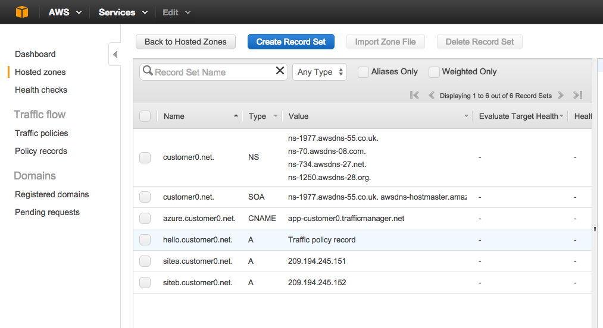
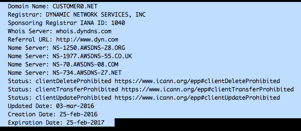
2. Create health checks (if desired) in "health checks". In our example, we create one health check per site from tthe last step, using the URL formatted from the "Health checks" section. Note that we need to create a separate site-specific health check with the correct Host header, if we want to take advantage of HTTPS health checking. (Or you can skip this and just use TCP health checking on port 443.)
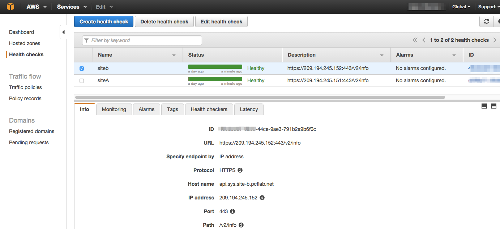


###Steps
1. Create a new Traffic policy, providing useful name and comments. After saving this metadata, you'll be presented with a GUI mapping tool. 
2. Since we'll be handing out IPv4 A records, select "A: IP address in IPv4 format" as start point. 
3. Create a Failover rule, with Primary and secondary set to the site A address records of each CF installation. Set the health checks per site that you created in the prereqs. (If instead you wanted ACTIVE/ACTIVE configuration of your sites, simply use the "Weighted" rule.)
4. Create endpoints for each separate CF installation, pointing at the public IP address of each CF installation.
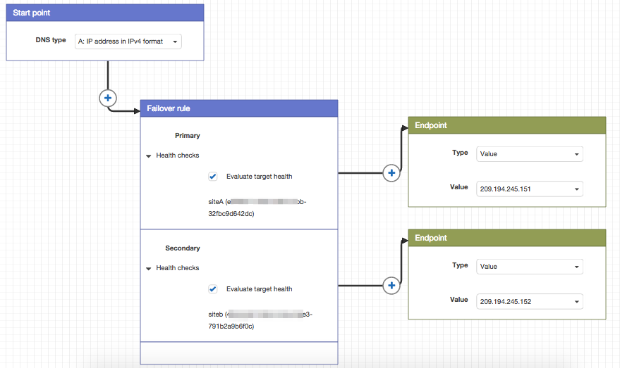
5. Save the policy, and optionally create a policy record, if you want to put it into production immeidately. This policy DNS record will be the public entry point to the load-balanced configuration, so it *must* match the installed route name in the CF routing tier. 
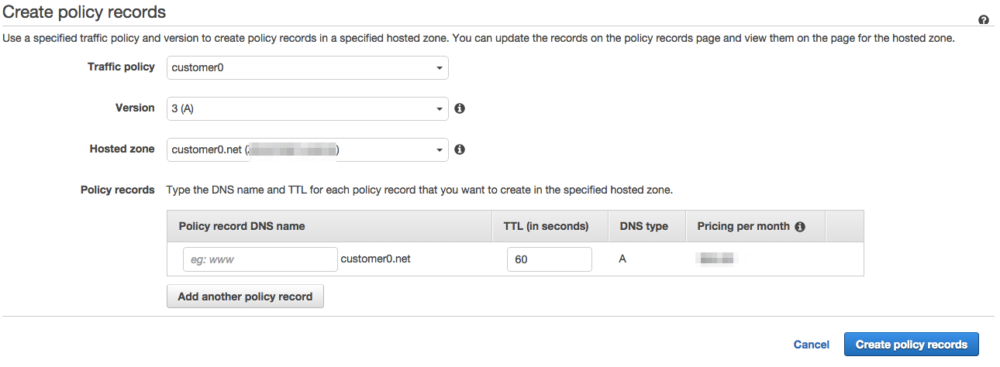
6. If you didn't attach a policy name at policy creation time, when you're ready to go to production, create the matching policy name and you're live.

##Dyn
###Prerequisites
1. We  assume that you've created your zone in DNS in "Manage DNS" in DynECT, and have correctly delegated the zone to Dyn.
2. Your application is deployed on CF with a known app name with the routes installed.

### Steps
1. In your zone under "Manage", you will add a new node that is the hostname of the app you're managing. In our example, we create a sample node named "Hello" which matches our "hello" app which is already deployed on our target foundation.
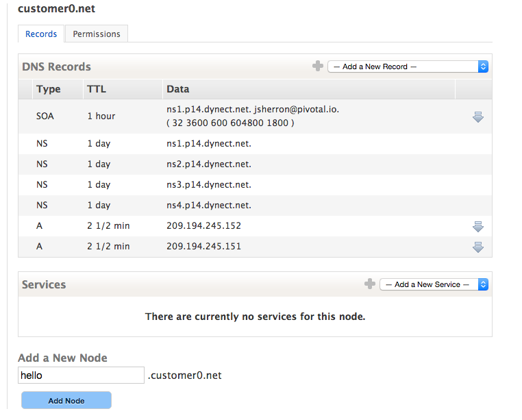
2. In the manage screen for the new node, select "Add Service" and add the traffic management service. (Depending on your Dyn subscription, you might choose Active Failover or Traffic Director. The same basic steps are applicable; we'll use Traffic Manager to create an Active/Active configuration.)
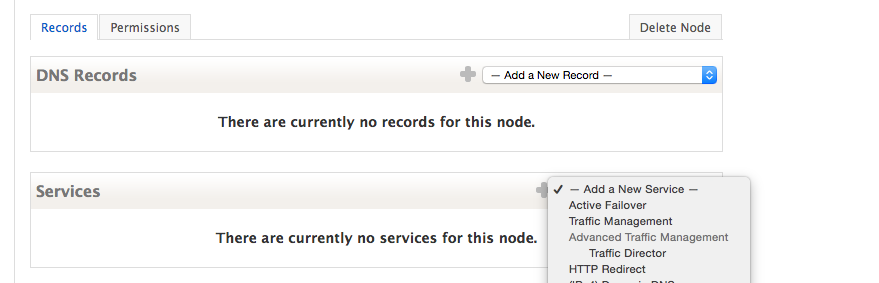
3. In the traffic management screen, create (at a minimum) a global pool containing the IP addresses of your local load balancers in each site. Serve mode will normally be "Monitor & Obey" if you want dynamic health checking to up/down your app based on health.
4. Configure any regional rules (such as geographic preferences), or leave set to default for full active-active.
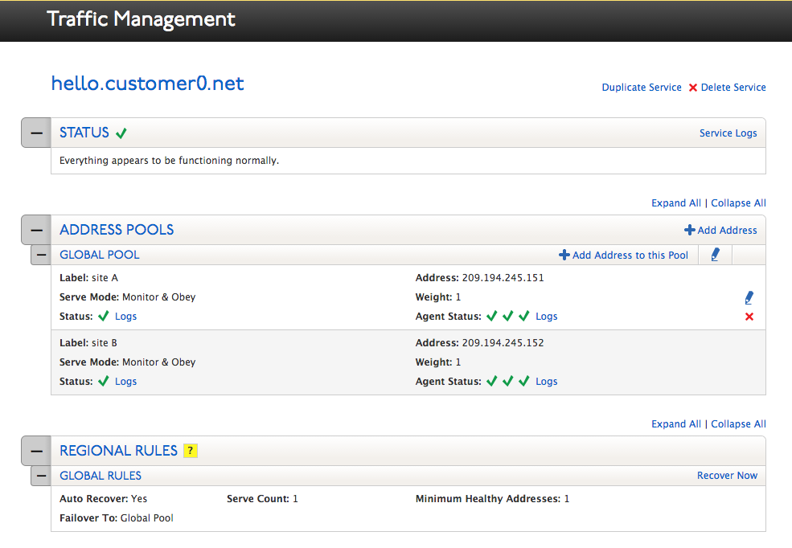
5. Set a TTL for your records that are appropriate. Depending on your health checking, this value will typically be half of your health check interval. A good starting point is 10 minutes health check and 5 minute TTL.
6. Set the health monitor to TCP on port 443. This provides basic health checking that the CF instance is running and answering on the HTTPS port. (HTTPS monitoring isn't currently supported without deploying a separate CF app.)
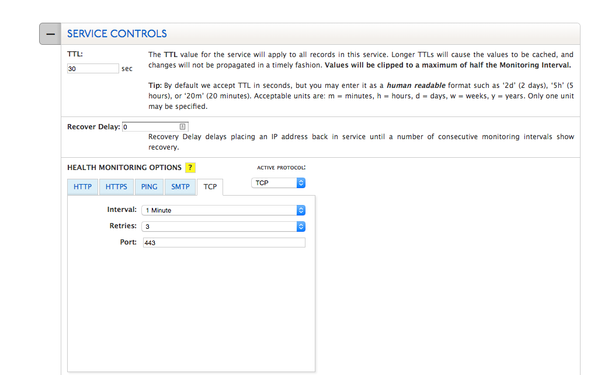
7. Set any notification options for any events of interest.
8. "Store" the configuration and be sure to "PUBLISH" it when ready to go live.
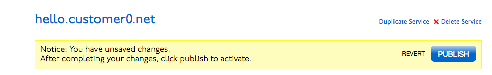


When complete, you should see some auto-generated A records show up in your DNS zone, with a TTL of half the healthcheck interval.
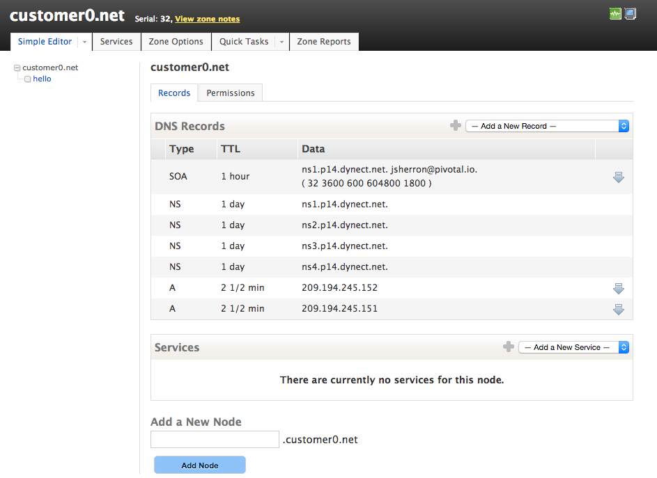


## GSLB PCF w/ Azure Traffic Manager
### Steps

Details


## GSLB PCF w/ F5
### Steps

Details
