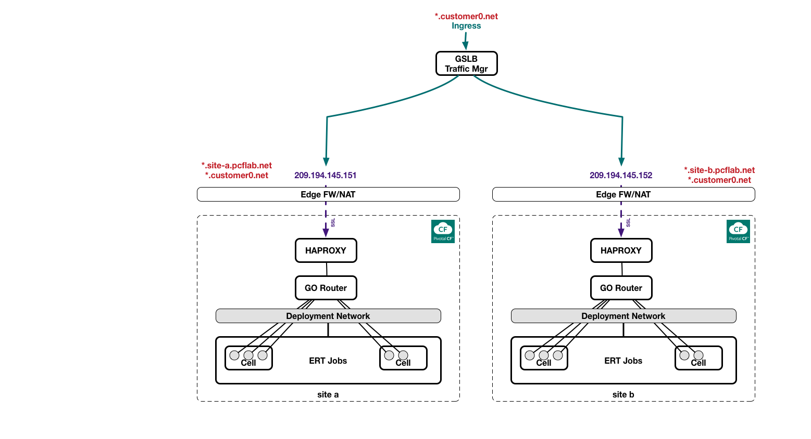

 
Global Server Load Balancing (GSLB) PCF
 
 **THIS IS A DRAFT !!!**

# Overview

This document describes 4 solutions on how to deploy multiple instances (or foundations) of PCF and load balance between them with various public and priave on prem GSLB methods.

The 

# Solution Logical Architecture

# Planning & Pre-Requisites
## Solution Requirements
### PCF
### SSL
### DNS
### GSLB Provider Requirements
* Amazon Route 53
* Azure Traffic Manager
* Dyn
* F5 (On Prem)

# Solution Deployment 
## GSLB PCF w/ AWS Route 53
### Steps

Details

## GSLB PCF w/ Azure Traffic Manager
### Steps

Details

## GSLB PCF w/ AWS Dyn Managed DNS Traffic Management
### Steps

Details

## GSLB PCF w/ F5
### Steps

Details
