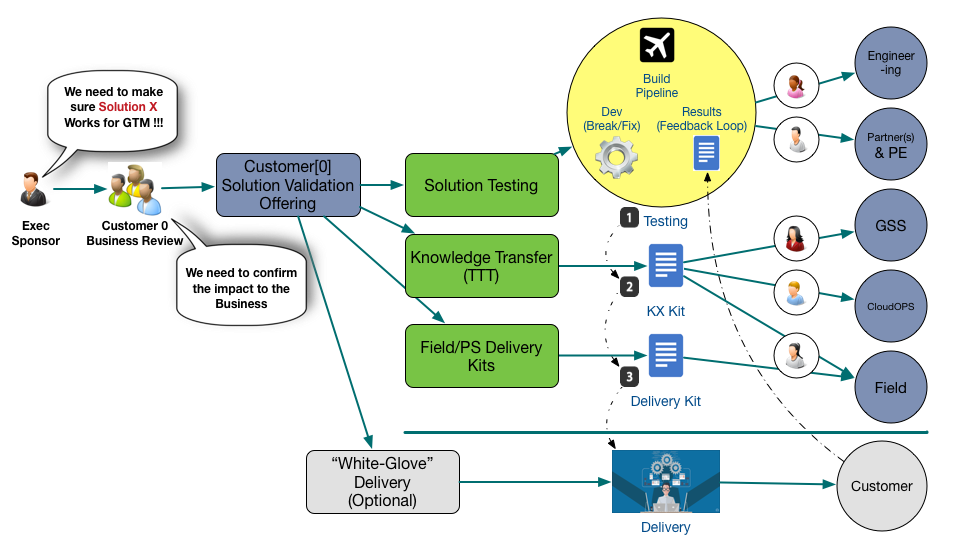

Customer[0]-GSLB Documentation

 

## Introduction
Customer[0] is an effort driven by the PCF Solutions team to attempt to replicate the experience of deploying a production-scale version of a PCF Solution requiring unique configuration or features.

In this repository you will find 1 workstreams:

1. **The Delivery Kit ([DK](https://github.com/pivotal-customer0/glb-documentation/blob/master/Delivery-Kit/GSLB_PCF.md)):** is a collection of documents that are designed to be followed by PAs or PCFS personnel. The goal is to create a comprehensive series of step-by-step guides that are repeatable under several variations, like POC, production deployments, etc.
